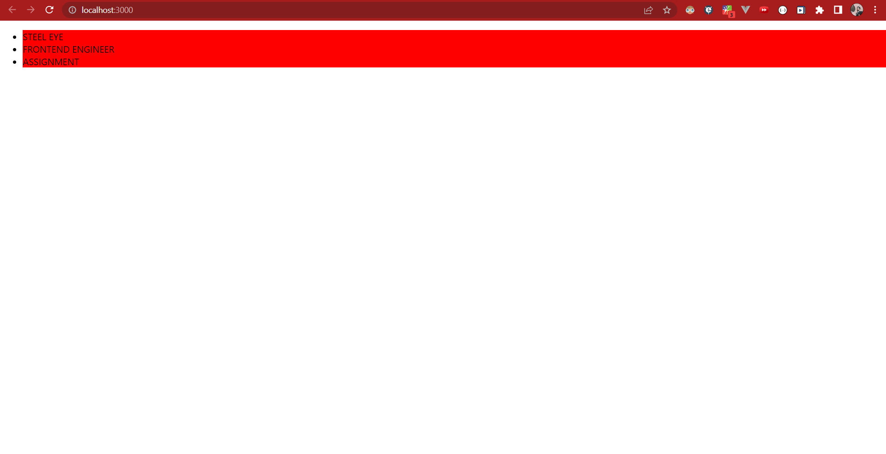
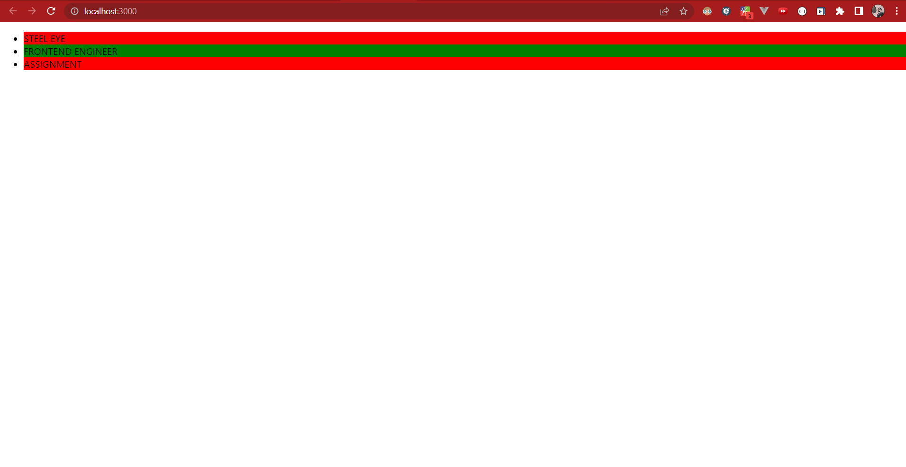

# Frontend Engineer Assignment

# React Component Code Review

## QUESTIONS:
1. Explain what the simple List component does.
2. What problems / warnings are there with code?
3. Please fix, optimize, and/or modify the component as much as you think is necessary.

## SOLUTIONS:
### 1. Explain what the simple List component does.
- Used to display/render data in an ordered format. The map() function is used for traversing the lists.
- Ex: 
```javascript
const list = ['a', 'b', 'c'];

const SimpleList = () => (
  <ul>
    {list.map(function(item) {
      return <li key={item}>{item}</li>;
    })}
  </ul>
);
```
- The List Component in the given code renders a Unordered List and using the SingleListItem component, props like onClickHandler, text, index and isSelected are called every time using map function. And It returns a Text which background color depending on which item is selected.

### 2. What problems / warnings are there with code?
#### A) In the useState() hook, the first parameter should be the variable representing current state and second parameter should be the set function that is used to update the state of the variable:
> Incorrect:
```javascript
const [setSelectedIndex, selectedIndex] = useState();
```
> Correct:
```javascript
const [selectedIndex, setSelectedIndex] = useState();
```

#### B) Error in defining WrappedListComponent.propTypes - it would be arrayOf instead of shapeOf.
- In propsTypes of WrappedListComponent, we are using depricated way to call propTypes validator's directly which is incorrect after react version 15.
- So, instead of array  and shapeOf we have to use arrayOf and shape respectively:
> Incorrect:
```javascript
WrappedListComponent.propTypes = {
  items: PropTypes.array(PropTypes.shapeOf({
    text: PropTypes.string.isRequired,
  })),
};
```
> Correct:
```javascript
WrappedListComponent.propTypes = {
  items: PropTypes.arrayOf(PropTypes.shape({
      text: PropTypes.string.isRequired,
    })
  ),
};
```
#### C) In WrappedListComponent.defaultProps, null items cannot be mapped.
- To correct, this error  we initialise the array items with some default values.
> Incorrect:
```javascript
WrappedListComponent.defaultProps = {
  items: null,
};
```
> Correct:
```javascript
WrappedListComponent.defaultProps = {
  items: [
    { text: "STEEL EYE", index: 1 },
    { text: "FRONTEND ENGINEER", index: 2 },
    { text: "ASSIGNMENT", index: 3 },
  ], 
};
```
#### D) Unique key prop is missing for List items
- The unique key prop is not provided to map. So it will show a Warning: Each child in a list should have a unique "key" prop.
> Incoorect:
```javascript
 <ul style={{ textAlign: 'left' }}>
      {items.map((item, index) => (
        <SingleListItem
          onClickHandler={() => handleClick(index)}
          text={item.text}
          index={index}
          isSelected={selectedIndex}
        />
      ))}
  </ul>
```
> Correct:
```javascript
    <ul style={{ textAlign: "left" }}>
      {items.map((item, index) => (
        <SingleListItem
          onClickHandler={() => handleClick(index)}
          text={item.text}
          index={index}
          key={index} 
          isSelected={selectedIndex}
        />
      ))}
    </ul>
```
#### E) onClick events should have a function reference instead of function call
- When a parameter is to be passed in an event handler, it needs to be wrapped with an arrow function.
> Incorrect:
```javascript
   <li style={{ backgroundColor: isSelected ? "green" : "red" }}
        onClick={onClickHandler(index)}>
       {text}
   </li>
```
> Correct: 
```javascript
    <li style={{ backgroundColor: isSelected ? "green" : "red" }}
        onClick={() => onClickHandler(index)}>
      {text}
    </li>
```

### F) Passing incorrect propType value in isSelected.
- Passing a number selectedIndex to isSelected which should be a bool
- PropType of isSelected is boolean but here passed proptype is number. so we have to provide bool values
- Also There should be a function reference instead of call
>Incorrect:
```javascript
    <li
      style={{ backgroundColor: isSelected ? 'green' : 'red'}}
      onClick={onClickHandler(index)}
    >
```
> Correct:
```javascript
    <li
      style={{ backgroundColor: isSelected ? "green" : "red" }}
      onClick={() => onClickHandler(Boolean(index))} 
    >
```

### 3. Please fix, optimize, and/or modify the component as much as you think is necessary.
```javascript
import React, { useState, useEffect, memo } from "react";
import PropTypes from "prop-types";

// Single List Item
const WrappedSingleListItem = ({ index, isSelected, onClickHandler, text }) => {
  return (
    <li
      style={{ backgroundColor: isSelected ? "green" : "red" }}
      onClick={() => onClickHandler(Boolean(index))}>
      {text}
    </li>
  );
};

WrappedSingleListItem.propTypes = {
  index: PropTypes.number,
  isSelected: PropTypes.bool,
  onClickHandler: PropTypes.func.isRequired,
  text: PropTypes.string.isRequired,
};

const SingleListItem = memo(WrappedSingleListItem);

// List Component
const WrappedListComponent = ({ items }) => {
  const [selectedIndex, setSelectedIndex] = useState(''); 

  useEffect(() => {
    setSelectedIndex(null);

  }, [items]);

  const handleClick = (index) => {
    setSelectedIndex((index));

  };

  return (
    <ul style={{ textAlign: "left" }}>
      {items.map((item, index) => (
        <SingleListItem
          onClickHandler={() => handleClick(index)}
          text={item.text}
          index={index}
          key={index} 
          isSelected={selectedIndex === index}
        />
      ))}
    </ul>
  );
};

WrappedListComponent.propTypes = {
  items: PropTypes.arrayOf(
    PropTypes.shape({
      text: PropTypes.string.isRequired,
    })
  ),
};

WrappedListComponent.defaultProps = {
  items: [
    { text: "STEEL EYE", index: 1 },
    { text: "FRONTEND ENGINEER", index: 2 },
    { text: "ASSIGNMENT", index: 3 },
  ], 
};


const List = memo(WrappedListComponent);

export default List;

```

## OUTPUT:
> WHEN NOT CLICKED:



> WHEN CLICKED EACH ITEM:


